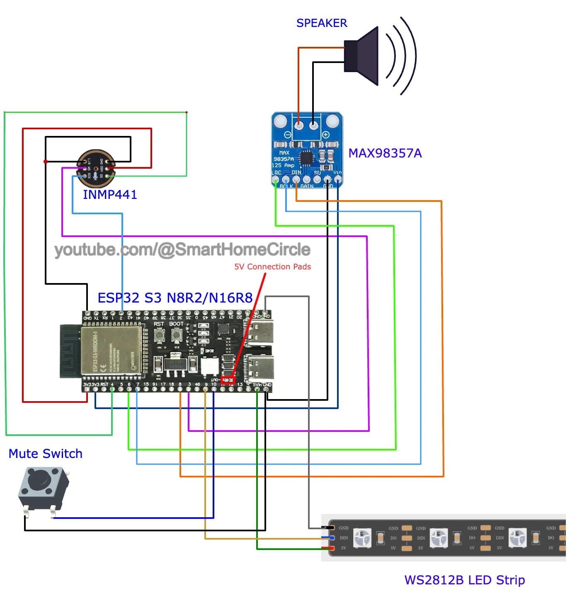

# My Local Voice Assistant HA

A DIY ESP32-S3 based Home Assistant Voice Assistant with on-device wake word detection using Micro Wake Word.

**Original Project:** [Go to Original Blog](https://smarthomecircle.com/How-I-created-my-voice-assistant-with-on-device-wake-word-using-home-assistant)

---

# Version History

## v1.2 - 2026-08-28

 IR Control Support Added

- Added IR Receiver support for learning and detecting remote control signals
- Added IR Transmitter support for sending IR commands
- Added initial IR control button for Fan Light
- IR receiver can detect and decode supported remote protocols
- Raw/Pronto IR data can also be captured for unsupported remotes
- Enables Home Assistant and Voice Assistant integration for controlling IR devices

### Example Voice Commands
- Turn on the Fan Light
- Turn off the Fan Light

## v1.1 - 2026-08-28

- Added animated faces for idle, listening, thinking and replying states
- Added sleep face after inactivity
- Added Home Assistant UI control for sleep timeout
- Added selectable timeout options from 30 seconds to 10 minutes
- Added Never option to disable sleep mode
- Added display color palette optimization
- Synced replying face with media player announcing state

## v1.0.1 - 2026-08-26

### Added
- Bluetooth Proxy support

---

## v1.0.0 - 2026-08-26

### Initial Stable Release

### Added
- ESP32-S3 Voice Assistant support
- Local on-device wake word detection
- Micro Wake Word support
- Okay Nabu wake word
- Hey Jarvis wake word
- Hey Mycroft wake word
- Stop wake word
- INMP441 I2S microphone support
- I2S speaker support
- MAX98357A audio amplifier support
- Speaker output
- WS2812B LED Ring support
- Home Assistant Voice Assistant integration
- OTA updates

### Updated
- Updated the original configuration for compatibility with current ESPHome and Home Assistant versions.
- Improved the project configuration based on the updated fixes provided for the original project.

### Fixed
- Fixed compilation issues encountered with the original configuration.
- Applied updated configuration changes to improve compatibility with newer ESPHome versions.

---

# Features

- ESP32-S3 based Voice Assistant
- Local on-device wake word detection
- Micro Wake Word support
- Multiple wake words
- Home Assistant Voice Assistant integration
- Local Voice Assist Pipeline support
- INMP441 I2S microphone support
- MAX98357A I2S audio amplifier support
- Speaker output
- WS2812B LED Ring support
- Mute control
- Wake sound
- Timer support
- Bluetooth Proxy support
- OTA updates

---

# Requirements

You will need:

- Home Assistant
- ESPHome
- ESP32-S3 development board
- INMP441 I2S microphone
- MAX98357A audio amplifier
- Speaker
- WS2812B LED strip or ring

> A speaker is required if you want to hear Voice Assistant responses.

---

# Circuit Diagram for ESP32 S3 With INMP441 Microphone & MAX98357A Audio Amplifier

This project uses an ESP32-S3 with:

- INMP441 I2S Microphone
- MAX98357A I2S Audio Amplifier
- Speaker
- Mute Switch
- WS2812B LED Strip

---

# Hardware Wiring

## INMP441 Microphone

| ESP32-S3 | INMP441 |
|---|---|
| GPIO4 | SD |
| GPIO3 | WS |
| GPIO2 | SCK |
| 3V3 | VDD |
| GND | GND |
| GND | L/R |

---

## MAX98357A Audio Amplifier

| ESP32-S3 | MAX98357A |
|---|---|
| GPIO6 | LRC |
| GPIO7 | BCLK |
| GPIO8 | DIN |
| 3V3 | VIN |
| GND | GND |

Connect your speaker to the MAX98357A speaker output.

---

## WS2812B LED Ring

| ESP32-S3 | WS2812B |
|---|---|
| GPIO9 | DIN |
| GND | GND |
| 5V | VIN |

---

## Mute Button

| ESP32-S3 | Button |
|---|---|
| GPIO10 | Switch Pin 1 |
| GND | Switch Pin 2 |

---

# Home Assistant Voice Assist Pipeline

Before using the device, configure a Voice Assist Pipeline in Home Assistant.

The recommended setup uses:

1. Whisper for Speech-to-Text
2. Piper for Text-to-Speech

Since this project uses on-device wake word detection through Micro Wake Word, a separate wake word add-on is not required.

After installing and configuring Whisper and Piper, create and select your Voice Assist Pipeline in Home Assistant.

---

# ESPHome Installation

The ESPHome configuration file is included in this repository:

`voice-assistant.yml`

## Steps

1. Open the ESPHome Dashboard.
2. Click **New Device**.
3. Give the device a name.
4. Select an **ESP32-S3** board.
5. Complete or skip the initial setup.
6. Open the newly created device and click **Edit**.
7. Replace the generated configuration with the configuration from `voice-assistant.yml`.
8. Update your Wi-Fi credentials and other required settings.
9. Save the configuration.
10. Compile and install the firmware.

> Make sure the configuration matches your ESP32-S3 board and hardware wiring.

---

# Manual Flashing

If you want to flash the firmware manually:

1. Compile the ESPHome configuration.
2. Choose **Manual Download**.
3. Select **Modern Format**.
4. Save the generated firmware file.
5. Open [ESPHome Web](https://web.esphome.io).
6. Connect the ESP32-S3 to your computer using USB.
7. Click **Connect**.
8. Select the correct USB serial device.
9. Click **Install**.
10. Select the firmware file and start the installation.

If the board does not enter flashing mode automatically:

1. Press and hold the **BOOT** button.
2. Press the **RESET** button.
3. Release the **RESET** button.
4. Release the **BOOT** button.
5. Try flashing again.

---

# Connect to Home Assistant

After the ESP32-S3 has been flashed and connected to Wi-Fi:

1. Open **Home Assistant**.
2. Go to **Settings**.
3. Open **Devices & Services**.
4. If the device is automatically discovered, click **Configure**.
5. If it is not discovered automatically, click **Add Integration**.
6. Search for **ESPHome**.
7. Enter the IP address of the ESP32-S3.
8. Use port `6053`.
9. If requested, enter the ESPHome API encryption key from your configuration.

After the device is added successfully, it can be used with Home Assistant Voice Assistant.

---

# Wake Words

The current configuration supports:

- Okay Nabu
- Hey Jarvis
- Hey Mycroft
- Stop

Wake word detection is performed locally on the ESP32-S3 using Micro Wake Word.

---

# Updating the Project

Future changes are tracked using GitHub commits and releases.

For each update:

1. Update `voice-assistant.yml`.
2. Commit the changes with a clear description.
3. Update the **Version History** section in this README when preparing a new version.
4. Create a new GitHub Release when the update is ready for release.
